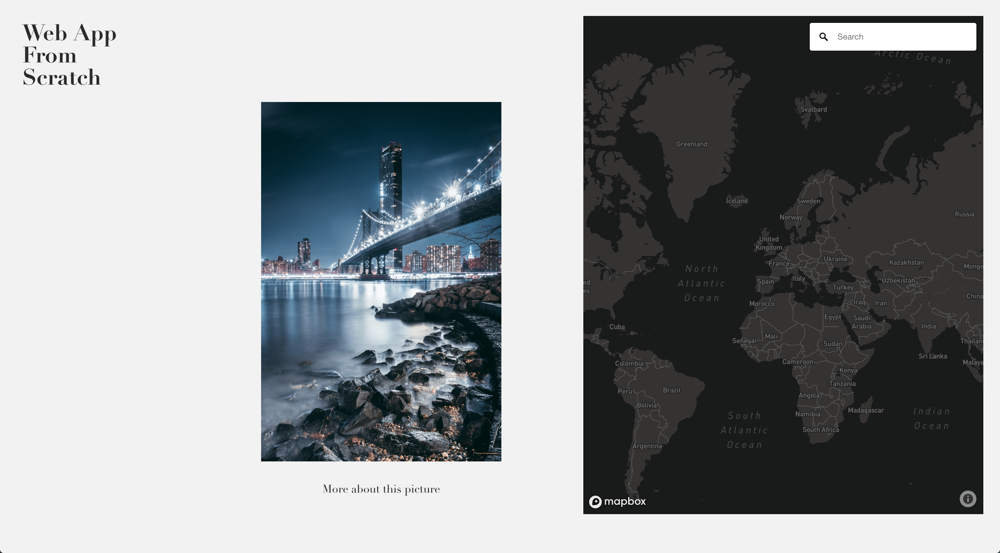

# Web App From Scratch @cmda-minor-web 18-19

**During this project I had to create an web application from scratch, that gets the data from an API. In this case the Unsplash API. The challenge: not using any external javascript libraries**




## Table of Contents
* [How to install](#how-to-install) 
* [Unsplash API](#unsplash-api)
* [Walktrough the application](#walk-trough-the-application) 
* [Learning process](#learning-process)
* [Resources](#resources)
* [Credits](#credits)
* [Checklist](#checklist)
* [License](#license)

## How to install

Before installing make sure you have installed the latest version of node.js.
Choose or make a new directory.
Load the template into your directory.

```bash
git clone https://github.com/chelseadoeleman/web-app-from-scratch-18-19.git
```

Make sure you are in the right directory 
```bash
cd web-app-from-scratch-18-19
```

Check if you have the latest version of npm.
Install the dependencies in [package.json](./package.json)
```bash
npm install
```

## Unsplash API

The unsplash API is pretty straight forward and the results are in JSON. I really liked the image url object ```regular```, in the API, where you can choose between five different image resolutions. I also found the most prominent ```color``` code in hexadecimals quite interesting. However I coudn't come up with a concept thus far to including this data object. 

The ```location``` was also very interesting, however not always defined. Because the location was available I decided to add the mapbox API to the application. 

At first I only could get ten results per page. However in the documentation I found you can get a maximum of 30 results per page. So I also had to fetch more pages to get more data. Without adding an header to the fetcher, you aren't able to do more than 50 request per hour. After adding the header I was able to send more requests.

```js
new Fetcher({ url, options: {headers: {'X-Ratelimit-Limit': '1000'}} }).fetch()
```

For my detailpage I dove deeper into the characeristics of a photo. So the person who took the photo, but also things like height and width. 


## Walktrough the application

In the application you can scroll through a slider, to see different images that can be found on [unsplash](https://unsplash.com/). Next to the unsplash image slider you can find a map of the world. When clicking on an image, you will get redirected to that location where the photo was either uploaded or taken. Depending on what location the author has given their photo(s). 

**NOTE** Right now there is an alert that tells you when the location is unknown, this has yet to be changed because it can be quite irritating. Sorry!

### Interaction diagram

<details>
  <summary> Version 1</summary>

  
</details>

<details>
  <summary> Version 2</summary>

  
</details>

<details>
  <summary> Version 3</summary>

  
</details>


### Actor diagram

Here is an abstract overview  of what happens in the application.


## Learning process

I started this week by looking at the issues that were opened on my github repository. Some I was able to resolve very quickly while others took up a lot more time. Like removing all globals from the global scope. Before I went and did this I dived deeper into Classes and begun with structuring all my files. Because of this I was able to get an better overview on how to divide my main file **app.js** into different files. I made four directory's: 

* helpers
* components
* routes
* views

I did have some issues with Classes, because it was quite a new concept to me especially the constructor function I found pretty hard to grasp. Eventualy I completely refactored my code and removed all globals.
Then I went to set up a Router. This I found the most difficult, because I knew what needed to happen but didn't know where to start. With a lot of help I set up a router and now I'm trying to render my [DetailView](./client/src/js/components/DetailView.js) page on hash. Because of this I wasn't able to dive into templates yet. which is something I still have to do for this week. 

I also improved my previous actor diagram and interaction diagram, altough I still struggle with those. Because I found it difficult to think of a whole file structure when I don't even know what's exactly going in there. 


## Resources

**API**
* [Unsplash](https://unsplash.com/developers)
* [Mapbox](https://www.mapbox.com/)

**Resources**
* [Parcel](https://parceljs.org/)
* [Babel polyfill](https://babeljs.io/docs/en/babel-polyfill)
* [Navigo](https://github.com/krasimir/navigo)

## Credits

*   **Maikel:** For helping with Classes and setting up the router.

## Checklist week 2
- [x] Resolve issues from last week.
- [x] Remove all globals from the global scope. 
- [x] Set up parcel to begin with exporting Classes.
- [x] Set up a Router.
- [x] Make an actor diagram.
- [x] Make an interaction diagram.
- [ ] Add Classes to the actor diagram. 
- [ ] Render Detailview by removing the index render. 
- [ ] Set up a template engine. 
- [x] Write a readme.md

## License
This repository is licensed as [MIT](LICENSE) by [Chelsea Doeleman](https://github.com/chelseadoeleman).
