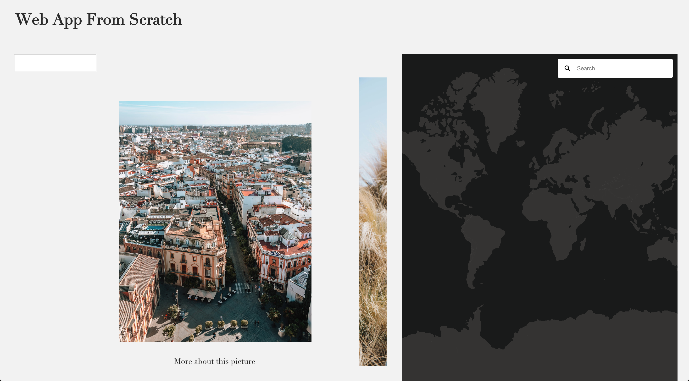

# | Web App From Scratch | Unsplash API |

**During this project I had to create an web application from scratch, that gets the data from an API. In this case the Unsplash API. The challenge: not using any external javascript libraries**



[Link to website](https://web-app-from-scratch-unsplash.netlify.com/)


## Table of Contents
* [How to install](#how-to-install) 
* [Unsplash API](#unsplash-api)
* [Walktrough the application](#walk-trough-the-application) 
* [Learning process](#learning-process)
* [Resources](#resources)
* [Credits](#credits)
* [Checklist](#checklist)
* [License](#license)

## How to install

Before installing make sure you have installed the latest version of node.js.
Choose or make a new directory.
Load the template into your directory.

```bash
git clone https://github.com/chelseadoeleman/web-app-from-scratch-18-19.git
```

Make sure you are in the right directory 
```bash
cd web-app-from-scratch-18-19
```

Check if you have the latest version of npm.
Install the dependencies in [package.json](./package.json)
```bash
npm install
```

## Unsplash API

The unsplash API is pretty straight forward and the results are in JSON. I really liked the image url object ```regular```, in the API, where you can choose between five different image resolutions. I also found the most prominent ```color``` code in hexadecimals quite interesting. However I coudn't come up with a concept thus far to including this data object. 

The ```location``` was also very interesting, however not always defined. Because the location was available I decided to add the mapbox API to the application. 

At first I only could get ten results per page. However in the documentation I found you can get a maximum of 30 results per page. So I also had to fetch more pages to get more data. Without adding an header to the fetcher, you aren't able to do more than 50 request per hour. After adding the header I was able to send more requests.

```js
new Fetcher({ url, options: {headers: {'X-Ratelimit-Limit': '1000'}} }).fetch()
```

For my detailpage I dove deeper into the characeristics of a photo. So the person who took the photo, but also things like height and width. 


## Walktrough the application

In the application you can scroll through a slider, to see different images that can be found on [unsplash](https://unsplash.com/). Next to the unsplash image slider you can find a map of the world. When clicking on an image, you will get redirected to that location where the photo was either uploaded or taken. Depending on what location the author has given their photo(s). 

The Application also has a search function, to get the images you would like to see. And when clicking on the link under the photo you are able to view more details about that picture.

**NOTE** Right now there is an alert that tells you when the location is unknown, this has yet to be changed because it can be quite irritating. Sorry!

### Interaction diagram

<details>
  <summary> Version 1</summary>

  
</details>

<details>
  <summary> Version 2</summary>

  
</details>

<details open>
  <summary> Version 3</summary>

  
</details>


### Actor diagram

Here is an abstract overview  of what happens in the application.

<details>
  <summary> Version 1</summary>

  !
</details>

<details>
  <summary> Version 2</summary>

  
</details>

<details open>
  <summary> Version 3</summary>

  
</details>


## Learning process

<details>
  <summary> Week 1</summary>

  #### Week 1

  Before this assignment I've worked once with an api. So although I knew what to do I always have trouble getting started. However when I retrieved the data everything ran smoothly. I had fun while making the image slider. And because I wanted to do more with the slider I decided to look at another API. This time Mapbox, because the Google maps API isn't available for free anymore ☹️. Getting started with Mapbox went quite smoothly and adding a search bar too. However I had trouble assigning the location to the searchbox. Together with Maikel I finally figured it out and now it's up and running! I do want to add pinmarks in the future, but before I can do this I have to get my location in longitude and latitude...
</details>

<details>
  <summary> Week 2</summary>

  #### Week 2

  I started this week by looking at the issues that were opened on my github repository. Some I was able to resolve very quickly while others took up a lot more time. Like removing all globals from the global scope. Before I went and did this I dived deeper into Classes and begun with structuring all my files. Because of this I was able to get an better overview on how to divide my main file **app.js** into different files. I made four directory's: 

* helpers
* components
* routes
* views

I did have some issues with Classes, because it was quite a new concept to me especially the constructor function I found pretty hard to grasp. Eventualy I completely refactored my code and removed all globals.
Then I went to set up a Router. This I found the most difficult, because I knew what needed to happen but didn't know where to start. With a lot of help I set up a router and now I'm trying to render my [DetailView](./client/src/js/components/DetailView.js) page on hash. Because of this I wasn't able to dive into templates yet. which is something I still have to do for this week. 

I also improved my previous actor diagram and interaction diagram, altough I still struggle with those. Because I found it difficult to think of a whole file structure when I don't even know what's exactly going in there. 
</details>


<details>
  <summary> Week 3</summary>

  #### Week 3

  This week I started of by dividing my functions into smaller functions. I had really large files that definitely needed to be refactored. Then I wrote some functions to Classes, when possible. I really wanted to dive deeper into the part where I would be extending classes. However because I refactored my code so that some Classes didn't really have the same functionality anymore, it wasn't practical to extend these Classes. I would like to learn more about Classes tho and if I had more time I probably would have looked into this and found a way to try to use it. Alas I broke a lot of functionalities while refactoring my code so I had to resolve a lot of errors. 

  On the second day we did a feedback session with the ruberic, this for me was really insightful. And after the feedback session last friday and discussing it with some classmates we came to the conclusion, that adding a template wouldn't be very usefull, because I don't render that much data. I did add a search function to my application, just so that the user could interact with it more. And added an 404 page and gave the user some feedback. However in the end I didn't get to error handeling. Then I stored the data from [DetailView.js](./client/src/js/components/DetailView.js) into localStorage and retrieved the data, for faster user experience and not to overload the Unsplash API. I also itterated on my Interaction and Actor diagram and made a new version.
</details>


## Resources

**API**
* [Unsplash](https://unsplash.com/developers)
* [Unsplash documentation](https://unsplash.com/documentation)
* [Unsplash github](https://github.com/unsplash/unsplash-js)
* [Mapbox](https://www.mapbox.com/)
* [Mapbox query](https://github.com/mapbox/mapbox-gl-geocoder/blob/master/API.md#query)
* [Geocoder](https://docs.mapbox.com/mapbox-gl-js/example/mapbox-gl-geocoder/)

**Resources**
* [Parcel](https://parceljs.org/)
* [Babel polyfill](https://babeljs.io/docs/en/babel-polyfill)
* [Navigo](https://github.com/krasimir/navigo)
* [Classes](https://developer.mozilla.org/nl/docs/Web/JavaScript/Reference/Klasses)
* [Times function to start counting from 1 in an array](https://stackoverflow.com/questions/3746725/create-a-javascript-array-containing-1-n)

## Credits

*   **Maikel:** For helping with Classes and setting up the router.
*   **Tim:** For helping with the header, to be able to send more requests.

## Checklist week 1
- [x] Find an API of your interest
- [x] Retrieve data from the API asynchronous. 
- [x] Store data in an object (without parse, because data object are not defined as a string)
- [x] Show images in a slider
- [x] Add a little bit of styling to the application
- [x] Retrieve more pages/results from the API. 
- [ ]   Add snappoints to the images
- [x] Add another API (mapbox)
- [x] Add location from image into mapbox
- [ ]   Convert location to longitude and latitude
- [ ]   Add pins to the location on the map
- [ ]   Remove pop-up message when location is unknown with hover over image
- [x] Write a readme.md

## Checklist week 2
- [x] Resolve issues from last week.
- [x] Remove all globals from the global scope. 
- [x] Set up parcel to begin with exporting Classes.
- [x] Set up a Router.
- [x] Make an actor diagram.
- [x] Make an interaction diagram.
- [x] Add Classes to the actor diagram. 
- [x] Render Detailview by removing the index render. 
- [ ] Set up a template engine. 
- [x] Write a readme.md

## Checklist week 3
- [ ] Extending some Classes
- [x] Make functions smaller
- [x] Store data for the detailpage in localStorage.
- [x] Update actor and interaction diagram.
- [x] Look into templating, is it neccessary?
- [x] Add an loader
- [x] Add an 404 page
- [x] Write a readme.md

## License
This repository is licensed as [MIT](LICENSE) by [Chelsea Doeleman](https://github.com/chelseadoeleman).
