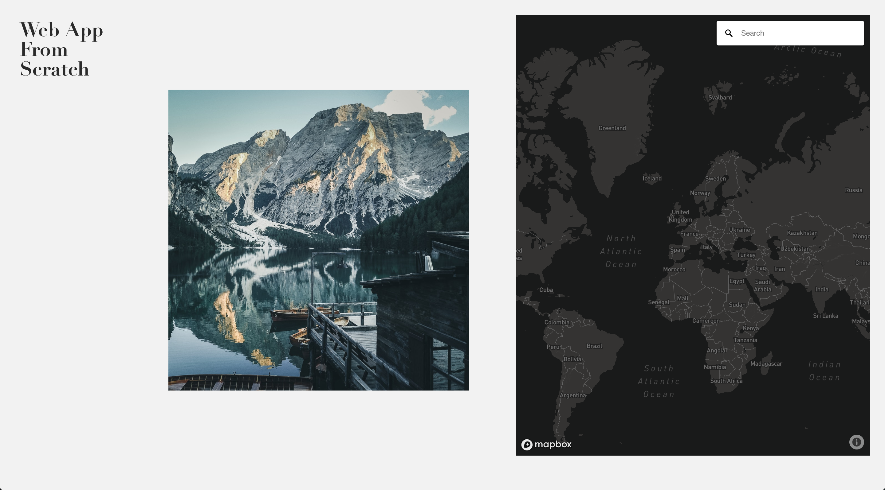

# Web App From Scratch @cmda-minor-web 18-19

**During this project I had to create an web application, that gets the data from a API. The most important part is getting the data asynchronous**




## Table of Contents
* [How to install](#how-to-install) 
* [Unsplash API](#unsplash-api)
* [Walktrough the application](#walk-trough-the-application) 
* [Learning process](#learning-process)
* [Resources](#resources)
* [Credits](#credits)
* [Checklist](#checklist)
* [License](#license)

## How to install

Before installing make sure you have installed the latest version of node.js
Choose or make a new directory.
Load the template into your directory.
```bash
git clone https://github.com/chelseadoeleman/web-app-from-scratch-18-19.git
```

Make sure you are in the right directory 
```bash
cd web-app-from-scratch-18-19
```

Check if you have the latest version of npm.
Install the dependencies in [package.json](../package.json)
```bash
npm install
```

There isn't a server build behind it yet, but feel free to do so. 

## Unsplash API 🐒

The unsplash API is pretty straight forward and the results are in JSON. I really liked the image url object ```regular```, in the API, where you can choose between five different image resolutions. I also found the most prominent ```color``` code in hexadecimals quite interesting. However I coudn't come up with a concept thus far to including this data object. 

The ```location``` was also very interesting, however not always defined. Because the location was available I decided to add the mapbox API to the application. 

At first I only could get ten results per page. However in the documentation I found you can get a maximum of 30 results per page. So I also had to fetch more pages to get more data.


## Walktrough the application

In the application you can scroll through a slider, to see different images that can be found on [unsplash](https://unsplash.com/). Next to the unsplash image slider you can find a map of the world. When clicking on an image, you will get redirected to that location where the photo was either uploaded or taken. Depending on what location the author has given their photo(s). 

**NOTE** Right now there is an alert that tells you when the location is unknown, this has yet to be changed because it can be quite irritating. Sorry!


In [app.js](../public/js/app.js) you can find all the logic. 
Here is an abstract overview  of what happens in the application.


## Learning process

Before this assignment I've worked once with an api. So although I knew what to do I always have trouble getting started. However when I retrieved the data everything ran smoothly. I had fun while making the image slider. And because I wanted to do more with the slider I decided to look at another API. This time Mapbox, because the Google maps API isn't available for free anymore ☹️. Getting started with Mapbox went quite smoothly and adding a search bar too. However I had trouble assigning the location to the searchbox. Together with Maikel I finally figured it out and now it's up and running! I do want to add pinmarks in the future, but before I can do this I have to get my location in longitude and latitude... 


## Resources

**API**
* [Unsplash](https://unsplash.com/developers)
* [Mapbox](https://www.mapbox.com/)

**Resources**
* [Unsplash developers](https://unsplash.com/developers)
* [Unsplash documentation](https://unsplash.com/documentation)
* [Unsplash github](https://github.com/unsplash/unsplash-js)
* [Unsplash mapbox query](https://github.com/mapbox/mapbox-gl-geocoder/blob/master/API.md#query)
* [Unsplash geocoder](https://docs.mapbox.com/mapbox-gl-js/example/mapbox-gl-geocoder/)

## Credits

*   **Maikel:** For helping with mapbox.
*   **Tim:** For helping with the header, to be able to send more requests.

## Checklist week 1
- [x] Find an API of your interest
- [x] Retrieve data from the API asynchronous. 
- [x] Store data in an object (without parse, because data object are not defined as a string)
- [x] Show images in a slider
- [x] Add a little bit of styling to the application
- [x] Retrieve more pages/results from the API. 
- [ ]   Add snappoints to the images
- [x] Add another API (mapbox)
- [x] Add location from image into mapbox
- [ ]   Convert location to longitude and latitude
- [ ]   Add pins to the location on the map
- [ ]   Remove pop-up message when location is unknown with hover over image
- [x] Write a readme.md

## License
This repository is licensed as [MIT](LICENSE) by [Chelsea Doeleman](https://github.com/chelseadoeleman).
